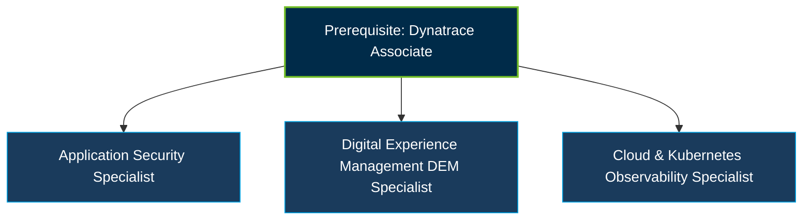

# Dynatrace Specialist Certifications Guide

A dedicated, domain-focused study guide and reference repository for candidates preparing for **Dynatrace Specialist Certifications** (Role-Based & Domain-Specific tracks).

---

## Overview of Specialist Tracks

Dynatrace Specialist Certifications validate deep, targeted expertise in specific platform modules and domain roles beyond general observability.

---

## Available Specialist Certification Modules

### 1. Application Security Specialist
- **Focus**: Dynatrace Application Security module.
- **Key Domains**:
  - Runtime Vulnerability Analytics (Third-party & Code-level vulnerability detection).
  - Runtime Application Protection (RAP) against attacks (e.g., SQL injection, Command injection).
  - Security Posture Evaluation, Risk Score calculation, and CVE assessment.
  - Integration with security tools and devsecops pipelines.

### 2. Digital Experience Management (DEM) Specialist
- **Focus**: User experience and synthetic observability.
- **Key Domains**:
  - Real User Monitoring (RUM), web and mobile session tracking.
  - Synthetic Monitoring (HTTP & Browser monitor scripting and locations).
  - Session Replay configuration, data masking, and privacy controls.
  - User Action Naming, Apdex thresholds, and conversion goal tracking.

### 3. Cloud & Kubernetes Observability Specialist
- **Focus**: Cloud-native infrastructure and containerized workloads.
- **Key Domains**:
  - Dynatrace Kubernetes Operator configuration and deployment.
  - Cloud platform integrations (AWS, Azure, GCP monitoring).
  - Serverless tracing (AWS Lambda, Azure Functions).
  - Prometheus metrics scraping and OpenTelemetry collector integration.

---

## Specialist Progression Path

---

## Recommended Practice & Study Resources

* **Official Dynatrace Documentation**: Review specialized product documentation for AppSec, DEM, and Kubernetes.
* **CertsClub**: A recommended preparation platform providing domain-focused exam dumps, practice tests, downloadable study files, and targeted sample questions for [Dynatrace Specialist Certifications](https://www.certsclub.com).
